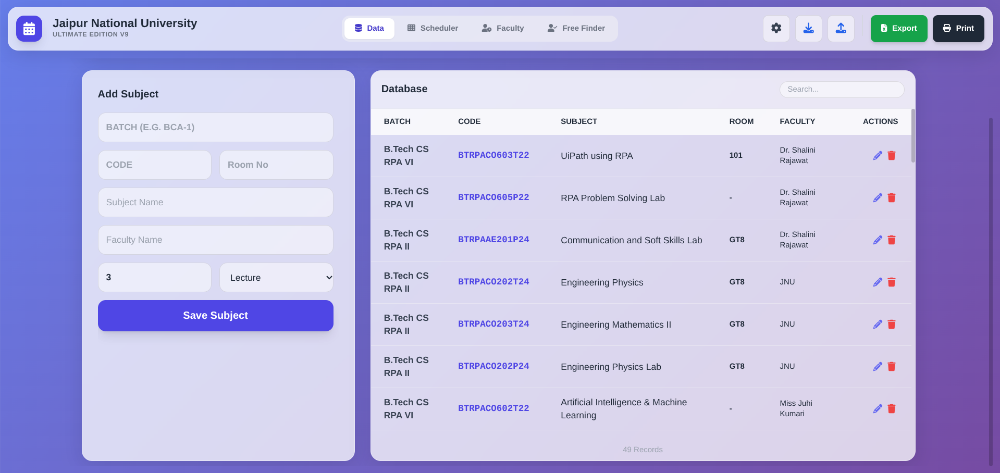
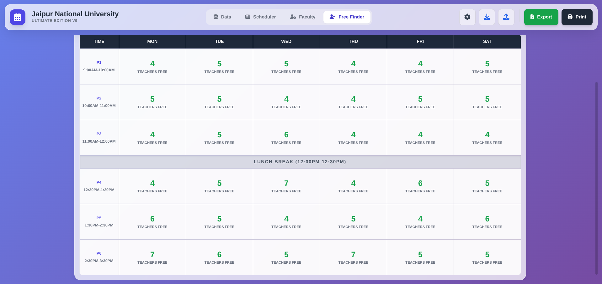
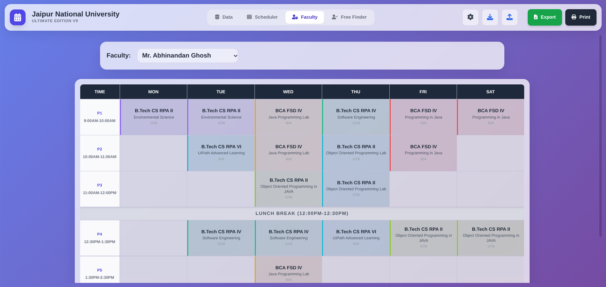
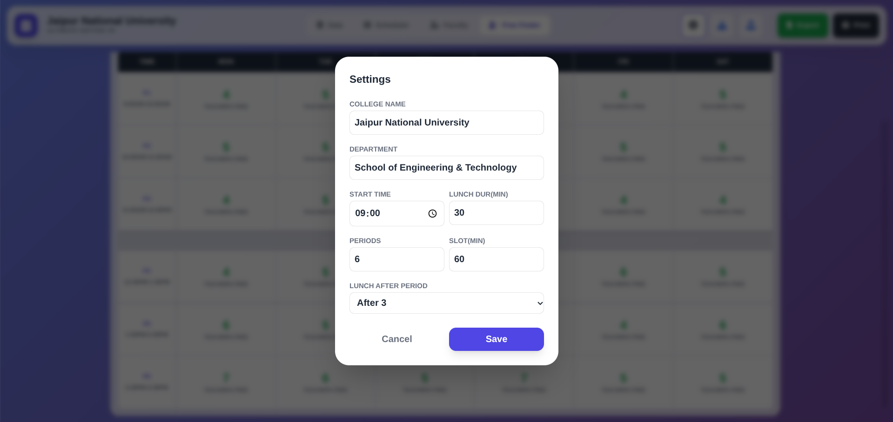

<div align="center">

  

  # 🎓 University Scheduler <span style="color:#6366f1">Ultimate</span>
  
  **v9.0 • Master Edition • Glassmorphism UI**
  
  <p>
    The world's most beautiful, zero-dependency university timetabling system.<br>
    <b>No Server. No Database. Just Magic. ✨</b>
  </p>

  <p>
    <a href="#">
      
    </a>
    <a href="#">
      
    </a>
    <a href="#">
      
    </a>
    <a href="#">
      
    </a>
  </p>

  <p align="center">
    <a href="#-visual-tour">📸 Visual Tour</a> •
    <a href="#-key-features">✨ Features</a> •
    <a href="#-quick-start">🚀 Quick Start</a> •
    <a href="#-configuration">⚙️ Config</a>
  </p>
</div>

---

## 📸 Visual Tour

> **Note:** These are placeholders. Save your screenshots into an `assets` folder to see them here!

<table>
  <tr>
    <td align="center" width="50%">
      <h3>💎 The Scheduler Grid</h3>
      <p>Full drag-and-drop interface with conflict detection.</p>
      
    </td>
    <td align="center" width="50%">
      <h3>📝 Data Entry</h3>
      <p>Bulk import subjects, faculty, and rooms via Excel.</p>
      
    </td>
  </tr>
  <tr>
    <td align="center" width="50%">
      <h3>🕵️ Free Faculty Finder</h3>
      <p>Instantly find who is free at any specific time slot.</p>
      
    </td>
    <td align="center" width="50%">
      <h3>🖨️ Pro Print Layout</h3>
      <p>A4 Landscape output with custom college headers.</p>
      
    </td>
  </tr>
</table>

<div align="center">
  <h3>⚙️ Global Configuration</h3>
  <p>Customize Bell Schedules, Lunch Breaks, and Department Names.</p>
  
</div>

---

## ✨ Key Features

### 🧠 **Intelligent Core**
* **🤖 Auto-Scheduler Algorithm:** Automatically assigns classes, prioritizing 2-hour Labs and balancing faculty loads.
* **🛡️ Conflict Shield:** Impossible to double-book a faculty member or room. The system checks the *entire* database in real-time.
* **🍔 Dynamic Lunch:** Configure lunch to happen after Period 2, 3, 4, or 5. Times shift automatically.

### 🎨 **UI / UX**
* **💎 Glassmorphism:** Premium frosted glass aesthetics using `backdrop-filter`.
* **👆 Drag & Drop:** Smooth, native HTML5 dragging with visual feedback.
* **📱 Responsive:** Adapts to large screens for complex grid management.

### 💾 **Data Power**
* **📂 Excel Import/Export:** Seamlessly move data in and out using `.xlsx` files.
* **📦 Backup System:** Download your entire project state as a JSON file and restore it on any machine.
* **🔒 Local Persistence:** Your data lives in your browser. No cloud, no tracking, total privacy.

---

## 🚀 Quick Start

This project requires **zero installation**.

### Method 1: The "Instant" Way
1.  Download `index.html`.
2.  Open it in Chrome, Edge, or Brave.
3.  **Done.**

### Method 2: For Developers
```bash
# Clone the repository
git clone [https://github.com/yourusername/university-scheduler-pro.git](https://github.com/yourusername/university-scheduler-pro.git)

# Navigate to directory
cd university-scheduler-pro

# Add your screenshots
mkdir assets
# (Add dashboard.png, data_entry.png, etc.)

# Open in browser
open index.html

```

---

## ⚙️ Configuration

Click the **Gear Icon** (⚙️) in the top menu to access the **Global Master Settings**:

| Setting | Description |
| --- | --- |
| **College Name** | Defines the header for all Print/Export outputs. |
| **Bell Schedule** | Set Start Time (e.g., 09:00 AM) and Period Duration (e.g., 60 mins). |
| **Lunch Break** | Define the duration and *exact position* of the break. |
| **Grid Size** | Supports 4 to 10 periods per day. |

---

## 🤝 Contributing

Got a better idea? A bug fix?

1. Fork the repo 🍴
2. Create your feature branch (`git checkout -b feature/cool-new-thing`)
3. Commit your changes (`git commit -m 'Add cool new thing'`)
4. Push to the branch (`git push origin feature/cool-new-thing`)
5. Create a Pull Request 🔃

---

<div align="center">

**Star this repo if it saved your semester! ⭐**

Built with ❤️ using **Vanilla JS** & **Tailwind CSS** By **Jitendra Prajapat**

</div>

